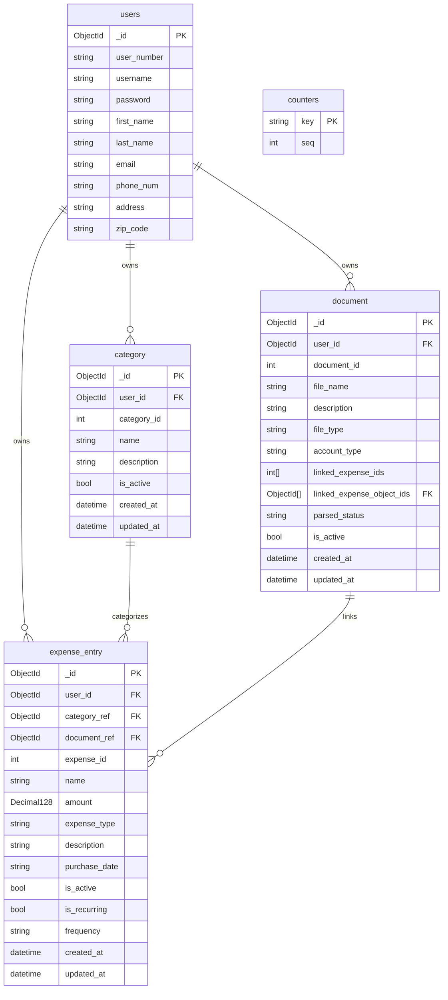

# FinanceTracker MongoDB Schema

> **Note:** `expense_type` is an enum: `"deposit"` or `"expense"`  
> `document_ref` on `expense_entry` is nullable (optional link)  
> `linked_expense_ids` stores integer IDs; `linked_expense_object_ids` stores the corresponding ObjectIds
